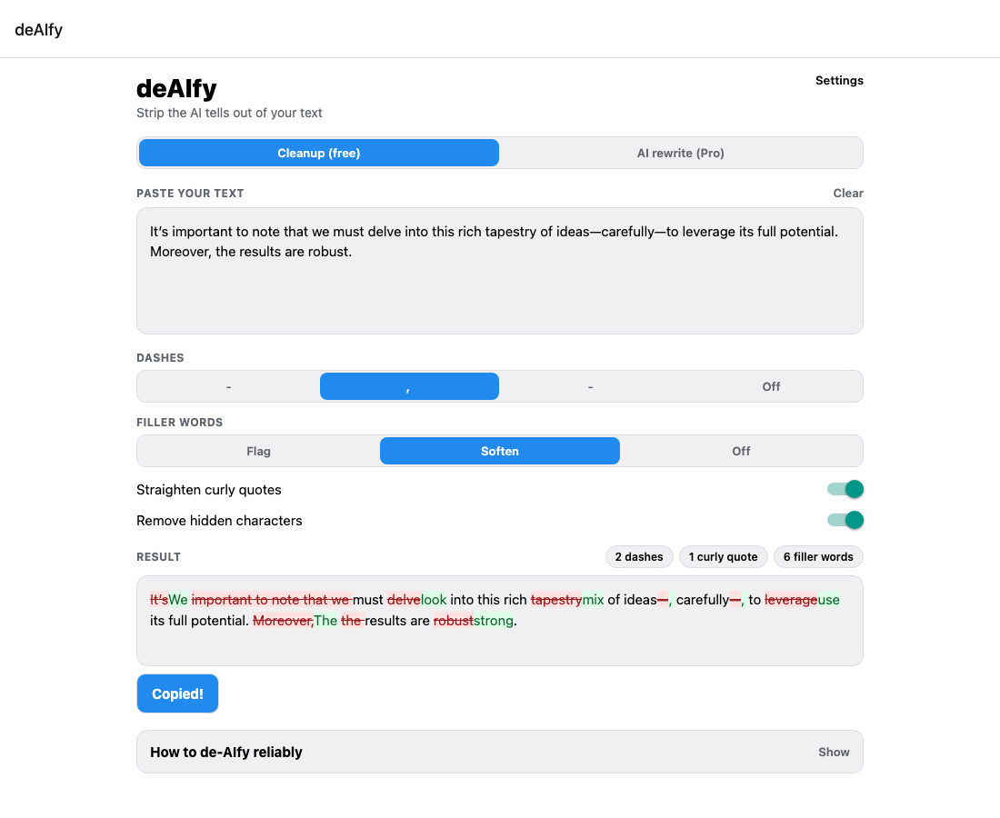
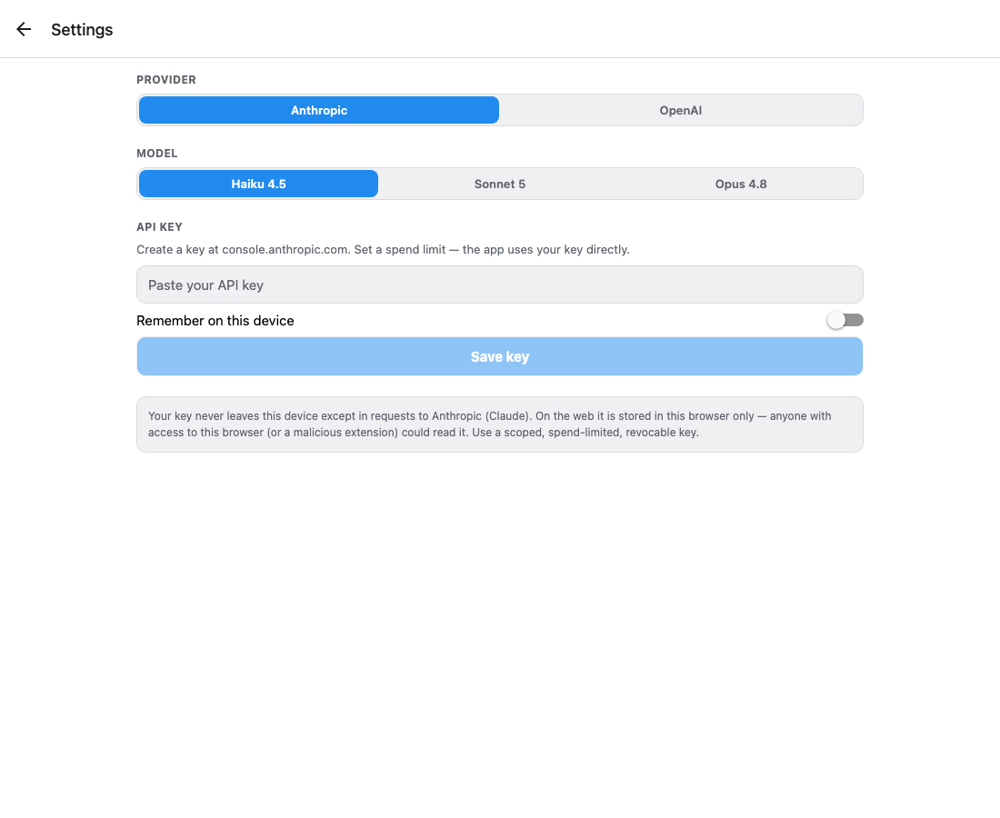

<p align="center">
  
</p>

<h1 align="center">deAIfy</h1>

<p align="center">
  Strip the tell-tale signs of AI writing out of your text (em dashes, curly quotes,
  hidden unicode, and filler words), or rewrite it to sound human.
  <br>One <a href="https://expo.dev">Expo</a> codebase → <b>web</b> + <b>Android</b>.
</p>

<p align="center">
  <a href="https://shayanmohd.github.io/deAIfy/"><b>🌐 Live web app</b></a>
  &nbsp;·&nbsp;
  <a href="https://github.com/shayanmohd/deAIfy/actions/workflows/deploy-web.yml">
    
  </a>
  &nbsp;·&nbsp;
  
</p>

---

## Two ways to clean text

| | **Cleanup (free)** | **AI rewrite (Pro)** |
|---|---|---|
| Runs | Fully on-device, **offline** | Your own LLM key, direct to provider |
| Cost | **Free forever**, no server, no bills | You pay your provider directly |
| What it does | Rule-based: fixes punctuation & unicode, flags/softens filler | Genuine rewrite to sound human |
| Privacy | Nothing leaves your device | Text goes only to the provider you pick |

There is **no backend**. The free cleaner is pure client-side code; Pro mode calls Anthropic
or OpenAI straight from your device with a key you provide. The project owner pays nothing to
run it.

## What it fixes

- **Em / en dashes** (`—` `–`) → comma, spaced hyphen, or plain hyphen (your choice)
- **Curly quotes & apostrophes** (`“ ” ‘ ’`) → straight `"` and `'`
- **Hidden characters**: non-breaking spaces, zero-width chars, BOM, and other invisible unicode
- **Filler words**: *delve, tapestry, leverage, moreover, in conclusion, it's important to note…*, then **flag** them or **soften** them away
- Code blocks, inline code, and URLs are **protected** and never touched
- A live diff shows exactly what changed, with per-category counts

<p align="center">
  
  
</p>

## Getting started

```bash
npm install
npm run web        # open the web app in your browser
npm run android    # run on an Android emulator/device (needs Android SDK)
npm test           # unit tests for the pure text-cleaning core
npm run typecheck  # tsc --noEmit
```

## How it's built

```
src/
  deaify/     ← PURE, framework-agnostic core (no react-native / expo / DOM imports)
    transforms/  dashes · quotes · spaces · fillerWords · protectCode
    data/        fillerWords.data.ts   (single source of truth, data-driven)
    pipeline.ts  protectCode → spaces → quotes → dashes → filler
    diff.ts      word-level diff of original vs final
  llm/        ← provider abstraction (anthropic · openai) + rewrite prompt
  storage/    ← key storage (Android Keystore on native, browser storage on web) + settings
  hooks/      ← useSettings · useDeaify (live, debounced) · useLlmRewrite
  ui/         ← Segmented, CleanupToggles, DiffView, CountChips, CopyButton, TipsPanel, …
  app/        ← expo-router routes: index (main) · settings (modal)
```

The entire text-cleaning engine (`src/deaify/**`) imports nothing from React Native, Expo, or
the DOM. That keeps it unit-tested in plain Node with `vitest`, idempotent, and reusable anywhere.

## Bring-your-own-key security

Your API key never leaves your device except in requests to the provider you choose.

- **Android:** stored in the encrypted **Android Keystore** (`expo-secure-store`).
- **Web:** stored **in your browser only**: `sessionStorage` by default, `localStorage` if you
  tick *"Remember on this device"*. Both are plaintext on the origin, so use a **scoped,
  spend-limited, revocable** key.

The key is never logged and is redacted from any error message.

## Deploying

- **Web** → GitHub Pages, automatically. Every push to `main` runs
  [`deploy-web.yml`](.github/workflows/deploy-web.yml), which runs `expo export --platform web`
  and publishes the static `dist/`. No server, no runtime cost.
- **Android** → build a release bundle with EAS or locally:
  ```bash
  npm run build:android          # EAS preview APK
  # or, for a Play Store AAB, prebuild + gradlew bundleRelease (see docs/ANDROID.md)
  ```

## License

[MIT](LICENSE)
